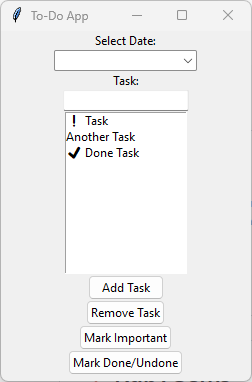

# Professional To-Do List App with Python



This is a professional To-Do List app built in Python using the tkinter library. It allows you to create, manage, and organize your tasks efficiently. The app stores tasks in a CSV file, offers a calendar feature to assign tasks to specific dates, and supports marking tasks as important or done. It also provides the functionality to send your tasks via email and displays tasks for a selected date.

## Features

- **User-Friendly GUI**: An intuitive graphical user interface built with tkinter.
- **CSV Data Storage**: Tasks are stored in a CSV file for data persistence.
- **Calendar Integration**: Assign tasks to specific dates with an integrated calendar.
- **Task Importance**: Mark tasks as important, with a distinct red background.
- **Email Task List**: Send your task list via email using SMTP.
- **Task Completion**: Easily mark tasks as done or undone, with visual cues.
- **Task Display**: View tasks for a selected date in a text box.

## Prerequisites

Before running the application, make sure you have the following installed:

- Python 3.x
- tkinter (usually included with Python)
- `tkcalendar` library (install using `pip install tkcalendar`)

## Installation

1. Clone the repository to your local machine:

   ```bash
   git clone https://github.com/yourusername/todo-list-app.git
   cd todo-list-app
   ```

2. Run the main application file:

   ```bash
   python main.py
   ```

## Usage

1. Launch the app by running `main.py`.
2. Use the calendar to select a date and add tasks for that day.
3. Mark tasks as important or complete using the provided buttons.
4. Modify or delete tasks as needed.
5. Send your task list via email for a specific date.

## Configuration

To configure email sending, open `config.json` and add your SMTP server details:

```json
{
    "smtp_server": "your_smtp_server",
    "smtp_port": 587,
    "smtp_username": "your_email@gmail.com",
    "smtp_password": "your_password"
}
```

## License

This project is licensed under the MIT License - see the [LICENSE](LICENSE) file for details.

## Acknowledgments

- Thanks to the tkinter and tkcalendar libraries for providing the GUI and calendar components.
- Inspired by the need for an organized task management system.

## Contributing

Contributions are welcome! Feel free to open issues or submit pull requests to improve the application.

---

Customize this `README.md` file to include any additional information about your project, such as future enhancements, known issues, or special instructions. Make sure to replace placeholders (e.g., `yourusername`, `your_smtp_server`, `your_email@gmail.com`, and `your_password`) with actual values or instructions as needed.
